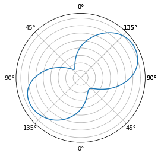
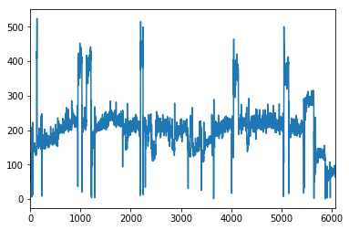
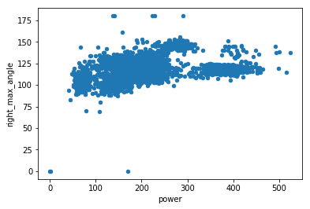
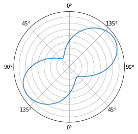

# wblib

Wblib is a library that offers a set of tools to work with Wattbike data. Wattbike session data can be downloaded directly from the Wattbike Hub.

## Installation
In the future it will be possible to install this library via `pip`. For now you need to clone this repository to be able to use it:
```
git clone git@github.com:AartGoossens/wblib.git
```

## Example usage
Start with importing the WattbikeHubClient:
```python
from wblib.client import WattbikeHubClient
```

If you are running this code from a Jupyter Notebook, run this code to show the plots inline:
```python
%matplotlib inline
```

Then finally, these lines are all you need to get all data from a Wattbike session:
```python
client = WattbikeHubClient()
wdf = client.get_session_dataframe('https://hub.wattbike.com/session/LYPWXEjF9B')
```

`wdf` is a WattbikeDataFrame, a sub class of [Pandas](http://pandas.pydata.org/) `DataFrame` so all features of a `DataFrame` are available. In addition, some Wattbike specific features are added.

To plot the average polar plot of the session:
```python
wdf.plot.polar()
```


To plot the power output during the session:
```python
wdf.power.plot()
```


To make a scatter plot of e.g. power and right_max_angle:
```python
wdf.plot.scatter(x='power', y='right_max_angle')
```


To calculate the average power, standard Pandas syntax is used:
```python
wdf.power.mean()
>> 206.10530695107892
```

It is also possible to do analyses on subset of the data, again in a Pandas-like way. For example, it is possible to plot the mean polar view for all revolutions over 400 Watt:
```python
wdf.loc[wdf.power > 400].plot.polar()
```


## License
This library is licensed under a MIT license. See [LICENSE](LICENSE).

## To do
- [ ] Add support for multiple sessions in a single WattbikeDataFrame
- [ ] Make it possible to plot all revolutions in a single polar plot
- [ ] Add import of .wse files
Feature request? Create an issue!
